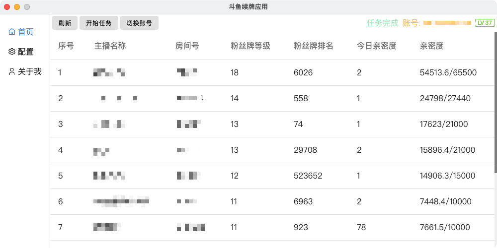
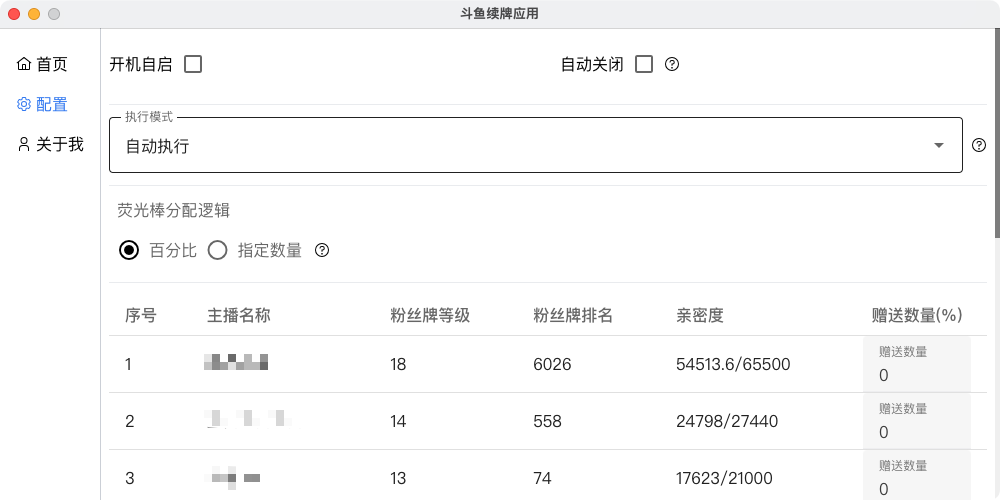

# 说明

斗鱼平台自动赠送荧光棒, 支持功能:
1. 模式一：开机自启, 赠送完成后自动关闭
2. 模式二：保持程序运行，定时赠送
3. 赠送数量自定义或者百分比自定义
4. 启动时为托盘模式, 点击托盘按钮显示GUI界面
5. 支持Windows和MacOS

# 后续功能

 - [ ] 双倍亲密度检测

寻求检测方法, 欢迎提供思路

# 开发

升级: `yarn up`. 禁止升级chalk, 保持V4.1.2版本

1. `yarn` 安装依赖
2. `yarn dev` 开发模式

# 打包

1. `yarn build:win`
2. `yarn build:mac`
3. `yarn build:linux`